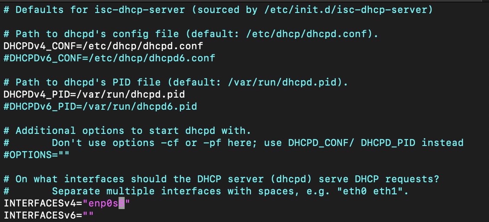
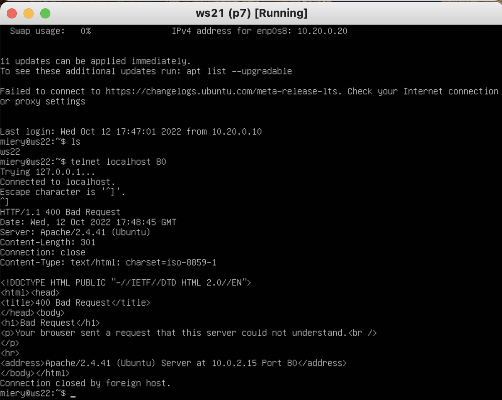

# D02_Linux darrpama

1. [Задания](#задания) \
   1.1. [Инструмент ipcalc](#part-1-инструмент-ipcalc) \
   1.2. [Статическая маршрутизация между двумя машинами](#part-2-статическая-маршрутизация-между-двумя-машинами) \
   1.3. [Утилита iperf3](#part-3-утилита-iperf3) \
   1.4. [Сетевой экран](#part-4-сетевой-экран) \
   1.5. [Статическая маршрутизация сети](#part-5-статическая-маршрутизация-сети) \
   1.6. [Динамическая настройка IP с помощью DHCP](#part-6-динамическая-настройка-ip-с-помощью-dhcp) \
   1.7. [NAT](#part-7-nat) \
   1.8. [Допополнительно. Знакомство с SSH Tunnels](#part-8-дополнительно-знакомство-с-ssh-tunnels)


## Задания

## Part 1 Инструмент ipcalc

**== Задание ==**

##### Поднять виртуальную машину (далее -- ws1)

#### 1.1. Сети и маски
##### Определить и записать в отчёт:
##### 1) Адрес сети *192.167.38.54/13*
##### 2) Перевод маски *255.255.255.0* в префиксную и двоичную запись, */15* в обычную и двоичную, *11111111.11111111.11111111.11110000* в обычную и префиксную
##### 3) Минимальный и максимальный хост в сети *12.167.38.4* при масках: */8*, *11111111.11111111.00000000.00000000*, *255.255.254.0* и */4*

#### 1.2. localhost
##### Определить и записать в отчёт, можно ли обратиться к приложению, работающему на localhost, со следующими IP: *194.34.23.100*, *127.0.0.2*, *127.1.0.1*, *128.0.0.1*

#### 1.3. Диапазоны и сегменты сетей
##### Определить и записать в отчёт:
##### 1) какие из перечисленных IP можно использовать в качестве публичного, а какие только в качестве частных: *10.0.0.45*, *134.43.0.2*, *192.168.4.2*, *172.20.250.4*, *172.0.2.1*, *192.172.0.1*, *172.68.0.2*, *172.16.255.255*, *10.10.10.10*, *192.169.168.1*
##### 2) какие из перечисленных IP адресов шлюза возможны у сети *10.10.0.0/18*: *10.0.0.1*, *10.10.0.2*, *10.10.10.10*, *10.10.100.1*, *10.10.1.255*


**== Выполнение ==**

* Скриншот с выводом команды
`cat /etc/issue` и установка ipcalc с помощью команды `sudo apt install ipcalc` 
*install ipcalc*<br>

### 1.1. Сети и маски

* ##### 1) Скриншот с выводом команды `ipcalc -b 192.167.38.54/13`
*ipcalc*<br>
##### Определили адрес сети хоста - 192.160.0.0

#### 2) 255.255.255.0 = /24 или 11111111.11111111.11111111.00000000,<br> /15 = 255.254.0.0 или 11111111.11111110.00000000.00000000, <br> 11111111.11111111.11111111.11110000 = 255.255.255.240 или /28

#### 3) Минимальный и максимальный хост в сети 12.167.38.4 при масках: /8 : min = 12.0.0.1, max = 12.255.255.254; <br> 11111111.11111111.00000000.00000000 : min = 12.167.0.1, max = 12.167.255.254; <br> 255.255.254.0 : min = 12.167.38.1, max = 12.167.39.254; <br>/4 : min = 0.0.0.1, max = 15.255.255.254;

### 1.2. localhost

#### Диапазон IP-адресов, которые предназначены для создания локальных сетей: 127.0.0.1 - 127.255.255.255 <br> 
---
#### 194.34.23.100 - нельзя использовать как localhost,
---
#### 127.0.0.2 - можно,
---
#### 127.1.0.1 - можно,
---
#### 128.0.0.1 - нельзя. <br><br>

### 1.3. Диапазоны и сегменты сетей

#### 10.0.0.0 — 10.255.255.255 (10.0.0.0/8),
#### 172.16.0.0 — 172.31.255.255 (172.16.0.0/12),
#### 192.168.0.0 — 192.168.255.255 (192.168.0.0/16).
#### 127.0.0.0 — 127.255.255.255 (Reserved for loopback interfaces (not used for communication between network nodes), so called localhost).
### Перечисленные выше сети являются `private` и получается что
---
#### 10.0.0.45 - private,
---
#### 134.43.0.2 - public,
---
#### 192.168.4.2 - private,
---
#### 172.20.250.4 - private,
---
#### 172.0.2.1 - public,
---
#### 192.172.0.1 - public,
---
#### 172.68.0.2 - public,
---
#### 172.16.255.255 - private,
---
#### 10.10.10.10 - private,
---
#### 192.169.168.1 - public. <br><br>
### Какие из перечисленных IP адресов шлюза возможны у сети 10.10.0.0/18:
----
#### 10.0.0.1 - может быть шлюзом
----
#### 10.10.0.2 - может
----
#### 10.10.10.10 - может
----
#### 10.10.100.1 - не может
----
#### 10.10.1.255 - может
----
<br><br>
### Part 2. Статическая маршрутизация между двумя машинами

**== Задание ==**

##### Поднять две виртуальные машины (далее -- ws1 и ws2)

##### С помощью команды `ip a` посмотреть существующие сетевые интерфейсы
- ##### В отчёт поместить скрин с вызовом и выводом использованной команды.
##### Описать сетевой интерфейс, соответствующий внутренней сети, на обеих машинах и задать следующие адреса и маски: ws1 - *192.168.100.10*, маска */16*, ws2 - *172.24.116.8*, маска */12*
- ##### В отчёт поместить скрины с содержанием изменённого файла *etc/netplan/00-installer-config.yaml* для каждой машины.
##### Выполнить команду `netplan apply` для перезапуска сервиса сети
- ##### В отчёт поместить скрин с вызовом и выводом использованной команды.

#### 2.1. Добавление статического маршрута вручную
##### Добавить статический маршрут от одной машины до другой и обратно при помощи команды вида `ip r add`
##### Пропинговать соединение между машинами
- ##### В отчёт поместить скрин с вызовом и выводом использованных команд.

#### 2.2. Добавление статического маршрута с сохранением
##### Перезапустить машины
##### Добавить статический маршрут от одной машины до другой с помощью файла *etc/netplan/00-installer-config.yaml*
- ##### В отчёт поместить скрин с содержанием изменённого файла *etc/netplan/00-installer-config.yaml*.
##### Пропинговать соединение между машинами
- ##### В отчёт поместить скрин с вызовом и выводом использованной команды.

**== Выполнение ==**

### 2.0. Поднял две виртуальные машины ws1 и ws2

### 2.1. Добавление статического маршрута вручную
#### Скриншот с выводом команды `ip a` на двух машинах
*ip a*<br>
### 2.1. Добавление статического маршрута вручную

#### Скриншот с содержанием изменённого файла `etc/netplan/00-installer-config.yaml`
*yaml*<br>
#### Скриншот с выполнением команд для перенастройки netplan, пробрасывания портов и пинг 
*netplan apply + ping*<br>
#### 2.2. Добавление статического маршрута с сохранением

#### Перезагрузил систему командой `reboot` и попробовал пропинговать машины снова, не получилось.
*ping*<br>

#### Изменяем файл `etc/netplan/00-installer-config.yaml` с указанием туннелей.
*yaml*<br>

#### Скриншот с выполнением команд для перенастройки netplan и пинг 
*netplan apply + ping*<br>

#### Перезагрузил систему командой `reboot` и попробовал пропинговать машины снова, на этот раз всё получилось.
*ping*<br>

### Part 3. Утилита **iperf3**

**== Задание ==**

#### 3.1. Скорость соединения
##### Перевести и записать в отчёт: 8 Mbps в MB/s, 100 MB/s в Kbps, 1 Gbps в Mbps

#### 3.2. Утилита **iperf3**
##### Измерить скорость соединения между ws1 и ws2
- ##### В отчёт поместить скрины с вызовом и выводом использованных команд.

**== Выполнение ==**

### 3.1. Скорость соединения
* #### 8Mbps = 1 MB/s
* #### 100 MB/s = 800000 Kbps
* #### 1Gbps = 1000 Mbps

### 3.2. Утилита **iperf3**
#### Установил iperf3 на 2 машины командой `sudo apt install iperf3`
#### На ws2 установил прослушивание порта 5201 командой `iperf3 -s`, на ws1 сделал коннект до ip ws2 командой `iperf3 -c 172.24.116.8 -p 5201`<br>

*iperf3*<br>
#### Скорость соединения = 4.64 Gbits/sec <br> <br>
### Part 4. Сетевой экран

**== Задание ==**

#### 4.1. Утилита **iptables**
##### Создать файл */etc/firewall.sh*, имитирующий фаерволл, на ws1 и ws2:
```shell
#!/bin/sh

# Удаление всех правил в таблице "filter" (по-умолчанию).
iptables –F
iptables -X
```
##### Нужно добавить в файл подряд следующие правила:
##### 1) на ws1 применить стратегию когда в начале пишется запрещающее правило, а в конце пишется разрешающее правило (это касается пунктов 4 и 5)
##### 2) на ws2 применить стратегию когда в начале пишется разрешающее правило, а в конце пишется запрещающее правило (это касается пунктов 4 и 5)
##### 3) открыть на машинах доступ для порта 22 (ssh) и порта 80 (http)
##### 4) запретить *echo reply* (машина не должна "пинговаться”, т.е. должна быть блокировка на OUTPUT)
##### 5) разрешить *echo reply* (машина должна "пинговаться")
- В отчёт поместить скрины с содержанием файла */etc/firewall* для каждой машины.
##### Запустить файлы на обеих машинах командами `chmod +x /etc/firewall.sh` и `/etc/firewall.sh`
- В отчёт поместить скрины с запуском обоих файлов.
- В отчёте описать разницу между стратегиями, применёнными в первом и втором файлах.

#### 4.2. Утилита **nmap**
##### Командой **ping** найти машину, которая не "пингуется", после чего утилитой **nmap** показать, что хост машины запущен
*Проверка: в выводе nmap должно быть сказано: `Host is up`*
- В отчёт поместить скрины с вызовом и выводом использованных команд **ping** и **nmap**.

##### Сохранить дампы образов виртуальных машин
<br>
**== Выполнение ==**
<br><br>

### 4.1. Утилита **iptables**

* #### Установил iptables `sudo apt get install iptables`
* #### На ws1 и ws2 создал файл `/etc/firewall.sh` в котором прописал следующие команды:
*firewall.sh*<br>
#### Далее запустил этот файл на обеих машинах командами `sudo chmod +x /etc/firewall.sh` и `sudo bash /etc/firewall.sh`, пропинговал соединения между машинами.
*firewall.sh*<br>
#### Разница между стратегиями заключается в том, что первое правило для OUTPUT `echo-reply` на ws1 было DROP и эта машина не пинговалась. Для ws2 первое правило - ACCEPT и ответ от этой машины приходит.

### 4.2. Утилита **nmap**
* #### Установил `nmap` командой `sudo apt install nmap`
* #### Не пингуется машина с ip 192.168.100.10, запустил `nmap 192.168.100.10`
*nmap*<br>

### Part 5. Статическая маршрутизация сети

**== Задание и выполнение ==**

##### Поднять пять виртуальных машин (3 рабочие станции (ws11, ws21, ws22) и 2 роутера (r1, r2))

### 5.1. Настройка адресов машин
##### Настроить конфигурации машин в *etc/netplan/00-installer-config.yaml* согласно сети на рисунке.
- ##### В отчёт поместить скрины с содержанием файла *etc/netplan/00-installer-config.yaml* для каждой машины.
*etc/netplan/00-installer-config.yaml*<br>
##### Перезапустить сервис сети. Если ошибок нет, то командой `ip -4 a` проверить, что адрес машины задан верно. Также пропинговать ws22 с ws21. Аналогично пропинговать r1 с ws11.
*etc/netplan/00-installer-config.yaml*<br>
 <br>
*ping ws11 - r1, ping ws21 - ws22*<br>
### 5.2. Включение переадресации IP-адресов.
##### Для включения переадресации IP, выполните команду на роутерах:
`sysctl -w net.ipv4.ip_forward=1` <br>
*При таком подходе переадресация не будет работать после перезагрузки системы.*
*переадресация которая не сохраняется*<br>
##### Откройте файл */etc/sysctl.conf* и добавьте в него следующую строку:
`net.ipv4.ip_forward = 1` <br>
*При использовании этого подхода, IP-переадресация включена на постоянной основе.*
*переадресация которая сохраняется*<br>
### 5.3. Установка маршрута по-умолчанию
Пример вывода команды `ip r` после добавления шлюза:
```
default via 10.10.0.1 dev eth0
10.10.0.0/18 dev eth0 proto kernel scope link src 10.10.0.2
```
##### Настроить маршрут по-умолчанию (шлюз) для рабочих станций. gateway4 [ip роутера] в файле конфигураций
*yaml*<br>
##### Вызвать `ip r` и показать, что добавился маршрут в таблицу маршрутизации
*commands `ip r`*<br>
##### Пропинговать с ws11 роутер r2 и показать на r2, что пинг доходит. Для этого использовать команду:
`tcpdump -tn -i eth1`
*ping*<br>

### 5.4. Добавление статических маршрутов
##### Добавить в роутеры r1 и r2 статические маршруты в файле конфигураций. Пример для r1 маршрута в сетку 10.20.0.0/26:
```shell
# Добавить в конец описания сетевого интерфейса eth1:
- to: 10.20.0.0
  via: 10.100.0.12
```
*yaml*<br>
##### Вызвать `ip r` и показать таблицы с маршрутами на обоих роутерах. Пример таблицы на r1:
```
10.100.0.0/16 dev eth1 proto kernel scope link src 10.100.0.11
10.20.0.0/26 via 10.100.0.12 dev eth1
10.10.0.0/18 dev eth0 proto kernel scope link src 10.10.0.1
```
*commands*<br>
##### Запустить команды на ws11:
`ip r list 10.10.0.0/[маска сети]` и `ip r list 0.0.0.0/0`
*commands*<br>
- Для адреса 10.10.0.0/\[маска сети\] был выбран маршрут, отличный от 0.0.0.0/0, хотя он попадает под маршрут по-умолчанию из-за того, что маршрут 0.0.0.0/0 используется при адресации без указания каких-либо других более конкретных маршрутов. 


### 5.5. Построение списка маршрутизаторов
Пример вывода утилиты **traceroute** после добавления шлюза:
```
1 10.10.0.1 0 ms 1 ms 0 ms
2 10.100.0.12 1 ms 0 ms 1 ms
3 10.20.0.10 12 ms 1 ms 3 ms
```
##### Запустить на r1 команду дампа:
`tcpdump -tnv -i eth0`
##### При помощи утилиты **traceroute** построить список маршрутизаторов на пути от ws11 до ws21
- В отчёт поместить скрины с вызовом и выводом использованных команд (tcpdump и traceroute).
- В отчёте, опираясь на вывод, полученный из дампа на r1, объяснить принцип работы построения пути при помощи **traceroute**.

*dump*<br>
##### Для определения промежуточных маршрутизаторов traceroute отправляет целевому узлу серию ICMP-пакетов (по умолчанию 3 пакета), с каждым шагом увеличивая значение поля TTL («время жизни») на 1.
*dump*<br>
##### Это поле обычно указывает максимальное количество маршрутизаторов, которое может быть пройдено пакетом. Первая серия пакетов отправляется с TTL, равным 1, и поэтому первый же маршрутизатор возвращает обратно ICMP-сообщение «time exceeded in transit», указывающее на невозможность доставки данных.
*dump*<br>
##### Traceroute фиксирует адрес маршрутизатора, а также время между отправкой пакета и получением ответа (эти сведения выводятся на монитор компьютера). Затем traceroute повторяет отправку серии пакетов, но уже с TTL, равным 2, что заставляет первый маршрутизатор уменьшить TTL пакетов на единицу и направить их ко второму маршрутизатору. Второй маршрутизатор, получив пакеты с TTL=1, так же возвращает «time exceeded in transit».

##### Процесс повторяется до тех пор, пока пакет не достигнет целевого узла. При получении ответа от этого узла процесс трассировки считается завершённым.

##### На оконечном хосте IP-датаграмма с TTL = 1 не отбрасывается и не вызывает ICMP-сообщения типа срок истёк, а должна быть отдана приложению. Достижение пункта назначения определяется следующим образом: отсылаемые traceroute датаграммы содержат UDP-пакет с заведомо неиспользуемым номером порта на адресуемом хосте. Номер порта будет равен 33434 + (максимальное количество транзитных участков до узла) — 1. В пункте назначения UDP-модуль, получая подобные датаграммы, возвращает ICMP-сообщения об ошибке «порт недоступен». Таким образом, чтобы узнать о завершении работы, программе traceroute достаточно обнаружить, что поступило ICMP-сообщение об ошибке этого типа.
*dump*<br>

### 5.6. Использование протокола **ICMP** при маршрутизации
##### Запустить на r1 перехват сетевого трафика, проходящего через eth0 с помощью команды:
`tcpdump -n -i eth0 icmp`
##### Пропинговать с ws11 несуществующий IP (например, *10.30.0.111*) с помощью команды:
`ping -c 1 10.30.0.111`
*commands*<br>
##### Сохранить дампы образов виртуальных машин

### Part 6. Динамическая настройка IP с помощью **DHCP**

**== Задание и выполнение ==**

##### Сначала установил на r2 `isc-dhcp-server`
##### Для r2 настроил в файле */etc/dhcp/dhcpd.conf* конфигурацию службы **DHCP**:
##### 1) указать адрес маршрутизатора по-умолчанию, DNS-сервер и адрес внутренней сети. Пример файла для r2:
*dhcp.conf*<br>
##### 2) в файле *resolv.conf* прописать `nameserver 8.8.8.8.`
*resolv.conf*<br>
##### Отредактировал файл /etc/default/isc-dhcp-server
*default*<br>
##### Перезагрузить службу **DHCP** командой `systemctl restart isc-dhcp-server`. 
*restart dhcp*<br>
##### Установил новые настройки у машины ws21, применил их `sudo netplan apply`
*restart dhcp*<br>
##### Машину ws21 перезагрузить при помощи `reboot` и через `ip a` показать, что она получила адрес. Также пропинговать ws22 с ws21.
*yaml*<br>
*ping*<br>
##### Указать MAC адрес у ws11, для этого в *etc/netplan/00-installer-config.yaml* надо добавить строки: `macaddress: 10:10:10:10:10:BA`, `dhcp4: true`
##### Также MAC надо указать в настройках адаптера виртуальной машины в virtualbox
- В отчёт поместить скрин с содержанием изменённого файла *etc/netplan/00-installer-config.yaml*.

##### Для r1 настроить аналогично r2, но сделать выдачу адресов с жесткой привязкой к MAC-адресу (ws11). Провести аналогичные тесты
##### Установил на r1 `isc-dhcp-server`
##### Для r1 настроил в файле */etc/dhcp/dhcpd.conf* конфигурацию службы **DHCP**:
##### 1) указать адрес маршрутизатора по-умолчанию, DNS-сервер и адрес внутренней сети:
*dhcp.conf*<br>
##### 2) в файле *resolv.conf* прописать `nameserver 8.8.8.8.`
*resolv.conf*<br>
##### Отредактировал файл /etc/default/isc-dhcp-server
*default*<br>
##### Перезагрузить службу **DHCP** командой `systemctl restart isc-dhcp-server.service`. 
*restart dhcp*<br>
##### Установил новые настройки у машины ws11, применил их `sudo netplan apply`, перезапустил машину. ВАЖНО установить mac адрес на виртуальном порте.
##### Получил ip который прописал
*restart dhcp*<br>

##### Запросить с ws21 обновление ip адреса
- В отчёте поместить скрины ip до и после обновления.
- В отчёте описать, какими опциями **DHCP** сервера пользовались в данном пункте.

##### Сохранить дампы образов виртуальных машин

### Part 7. **NAT**

**== Задание ==**

*В данном задании используются виртуальные машины из Части 5*
##### Загрузил снепшоты виртуальных машин из конца 5 части, убрал gateway из настроек yaml и установил на ws22 и r1 `apache2`
*install*<br>
##### В файле */etc/apache2/ports.conf* на ws22 и r1 изменить строку `Listen 80` на `Listen 0.0.0.0:80`, то есть сделать сервер Apache2 общедоступным
*ports.conf*<br>
##### Запустить веб-сервер Apache командой `service apache2 start` на ws22 и r1
*ports.conf*<br>
##### Добавить в фаервол, созданный по аналогии с фаерволом из Части 4, на r2 следующие правила:
##### 1) Удаление правил в таблице filter - `iptables -F`
##### 2) Удаление правил в таблице "NAT" - `iptables -F -t nat`
##### 3) Отбрасывать все маршрутизируемые пакеты - `iptables --policy FORWARD DROP`
##### Запускать файл также, как в Части 4
##### Проверить соединение между ws22 и r1 командой `ping`
*ping*<br>
*При запуске файла с этими правилами, ws22 не должна "пинговаться" с r1*
##### Добавить в файл ещё одно правило:
##### 4) Разрешить маршрутизацию всех пакетов протокола **ICMP**
##### Запускать файл также, как в Части 4
##### Проверить соединение между ws22 и r1 командой `ping`
*ping*<br>
*При запуске файла с этими правилами, ws22 должна "пинговаться" с r1*
##### Добавить в файл ещё два правила:
##### 5) Включить **SNAT**, а именно маскирование всех локальных ip из локальной сети, находящейся за r2 (по обозначениям из Части 5 - сеть 10.20.0.0)
*Совет: стоит подумать о маршрутизации внутренних пакетов, а также внешних пакетов с установленным соединением*
##### 6) Включить **DNAT** на 8080 порт машины r2 и добавить к веб-серверу Apache, запущенному на ws22, доступ извне сети
*Совет: стоит учесть, что при попытке подключения возникнет новое tcp-соединение, предназначенное ws22 и 80 порту*
*telnet*<br>
##### Запускать файл также, как в Части 4
*Перед тестированием рекомендуется отключить сетевой интерфейс **NAT** (его наличие можно проверить командой `ip a`) в VirtualBox, если он включен*
##### Проверить соединение по TCP для **SNAT**, для этого с ws22 подключиться к серверу Apache на r1 командой:
`telnet [адрес] [порт]`
##### Проверить соединение по TCP для **DNAT**, для этого с r1 подключиться к серверу Apache на ws22 командой `telnet` (обращаться по адресу r2 и порту 8080)
*telnet*<br>

##### Сохранить дампы образов виртуальных машин
**p.s. Ни в коем случае не сохранять дампы в гит!**

## Part 8. Дополнительно. Знакомство с **SSH Tunnels**

**== Задание ==**

*В данном задании используются виртуальные машины из Части 5*

##### Запустить на r2 фаервол с правилами из Части 7
##### Запустить веб-сервер **Apache** на ws22 только на localhost (то есть в файле */etc/apache2/ports.conf* изменить строку `Listen 80` на `Listen localhost:80`)
*ports.conf*<br>
*start apache2 in ws22*<br>
##### Воспользоваться *Local TCP forwarding* с ws21 до ws22, чтобы получить доступ к веб-серверу на ws22 с ws21
*local tcp*<br>
*telnet output*<br>
##### Воспользоваться *Remote TCP forwarding* c ws11 до ws22, чтобы получить доступ к веб-серверу на ws22 с ws11
*remote tcp*<br>
*telnet output*<br>
*remote tcp*<br>
*firewall*<br>

##### Сохранить дампы образов виртуальных машин
