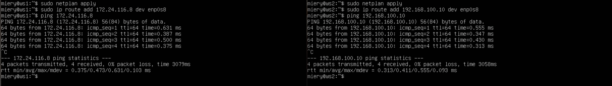

# D02_Linux darrpama

## Part 1 Инструмент ipcalc

**== Задание ==**

##### Поднять виртуальную машину (далее -- ws1)

#### 1.1. Сети и маски
##### Определить и записать в отчёт:
##### 1) Адрес сети *192.167.38.54/13*
##### 2) Перевод маски *255.255.255.0* в префиксную и двоичную запись, */15* в обычную и двоичную, *11111111.11111111.11111111.11110000* в обычную и префиксную
##### 3) Минимальный и максимальный хост в сети *12.167.38.4* при масках: */8*, *11111111.11111111.00000000.00000000*, *255.255.254.0* и */4*

#### 1.2. localhost
##### Определить и записать в отчёт, можно ли обратиться к приложению, работающему на localhost, со следующими IP: *194.34.23.100*, *127.0.0.2*, *127.1.0.1*, *128.0.0.1*

#### 1.3. Диапазоны и сегменты сетей
##### Определить и записать в отчёт:
##### 1) какие из перечисленных IP можно использовать в качестве публичного, а какие только в качестве частных: *10.0.0.45*, *134.43.0.2*, *192.168.4.2*, *172.20.250.4*, *172.0.2.1*, *192.172.0.1*, *172.68.0.2*, *172.16.255.255*, *10.10.10.10*, *192.169.168.1*
##### 2) какие из перечисленных IP адресов шлюза возможны у сети *10.10.0.0/18*: *10.0.0.1*, *10.10.0.2*, *10.10.10.10*, *10.10.100.1*, *10.10.1.255*

**== Выполнение ==**

* Скриншот с выводом команды
`cat /etc/issue` и установка ipcalc с помощью команды `sudo apt install ipcalc` 

### 1.1. Сети и маски

* 1) Скриншот с выводом команды `ipcalc -b 192.167.38.54/13`

Адрес сети - 192.160.0.0

* 2) 255.255.255.0 = /24 или 11111111.11111111.11111111.00000000,
/15 = 255.254.0.0 или 11111111.11111110.00000000.00000000,
11111111.11111111.11111111.11110000 = 255.255.255.240 или /28

* 3) Минимальный и максимальный хост в сети 12.167.38.4 при масках:
/8 : min = 12.0.0.1, max = 12.255.255.254;
11111111.11111111.00000000.00000000 : min = 12.167.0.1, max = 12.167.255.254;
255.255.254.0 : min = 12.167.38.1, max = 12.167.39.254;
/4 : min = 0.0.0.1, max = 15.255.255.254;

### 1.2. localhost

* Диапазон IP-адресов, которые предназначены для создания локальных сетей: 127.0.0.1 - 127.255.255.255
194.34.23.100 - нельзя использовать как localhost, 127.0.0.2 - можно, 127.1.0.1 - можно, 128.0.0.1 - нельзя.

### 1.3. Диапазоны и сегменты сетей

* 1) 10.0.0.0 — 10.255.255.255 (10.0.0.0/8),
172.16.0.0 — 172.31.255.255 (172.16.0.0/12),
192.168.0.0 — 192.168.255.255 (192.168.0.0/16).
127.0.0.0 — 127.255.255.255 (Reserved for loopback interfaces (not used for communication between network nodes), so called localhost).
Перечисленные выше сети являются `private` и получается что
10.0.0.45 - private, 134.43.0.2 - public, 192.168.4.2 - private, 172.20.250.4 - private, 172.0.2.1 - public, 192.172.0.1 - public, 172.68.0.2 - public, 172.16.255.255 - private, 10.10.10.10 - private, 192.169.168.1 - public.

* 2) Какие из перечисленных IP адресов шлюза возможны у сети 10.10.0.0/18: 10.0.0.1 - может быть шлюзом, 10.10.0.2 - может, 10.10.10.10 - может, 10.10.100.1 - не может, 10.10.1.255 - может

### Part 2. Статическая маршрутизация между двумя машинами

**== Задание ==**

##### Поднять две виртуальные машины (далее -- ws1 и ws2)

##### С помощью команды `ip a` посмотреть существующие сетевые интерфейсы
- В отчёт поместить скрин с вызовом и выводом использованной команды.
##### Описать сетевой интерфейс, соответствующий внутренней сети, на обеих машинах и задать следующие адреса и маски: ws1 - *192.168.100.10*, маска */16*, ws2 - *172.24.116.8*, маска */12*
- В отчёт поместить скрины с содержанием изменённого файла *etc/netplan/00-installer-config.yaml* для каждой машины.
##### Выполнить команду `netplan apply` для перезапуска сервиса сети
- В отчёт поместить скрин с вызовом и выводом использованной команды.

#### 2.1. Добавление статического маршрута вручную
##### Добавить статический маршрут от одной машины до другой и обратно при помощи команды вида `ip r add`
##### Пропинговать соединение между машинами
- В отчёт поместить скрин с вызовом и выводом использованных команд.

#### 2.2. Добавление статического маршрута с сохранением
##### Перезапустить машины
##### Добавить статический маршрут от одной машины до другой с помощью файла *etc/netplan/00-installer-config.yaml*
- В отчёт поместить скрин с содержанием изменённого файла *etc/netplan/00-installer-config.yaml*.
##### Пропинговать соединение между машинами
- В отчёт поместить скрин с вызовом и выводом использованной команды.

**== Выполнение ==**

### Поднял две виртуальные машины ws1 и ws2
Скриншот с выводом команды
`ip a` на двух машинах

Скриншот с содержанием изменённого файла `etc/netplan/00-installer-config.yaml`

Скриншот с выполнением команды `netplan apply` 
